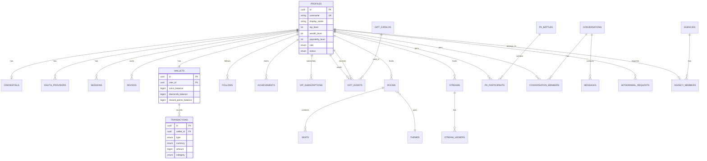
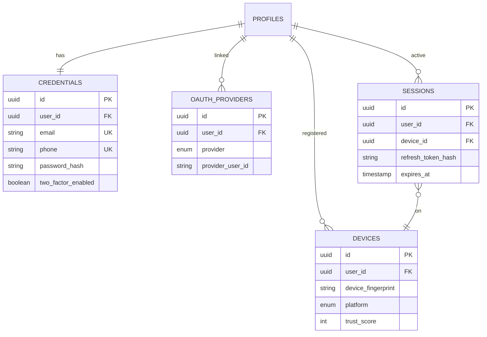
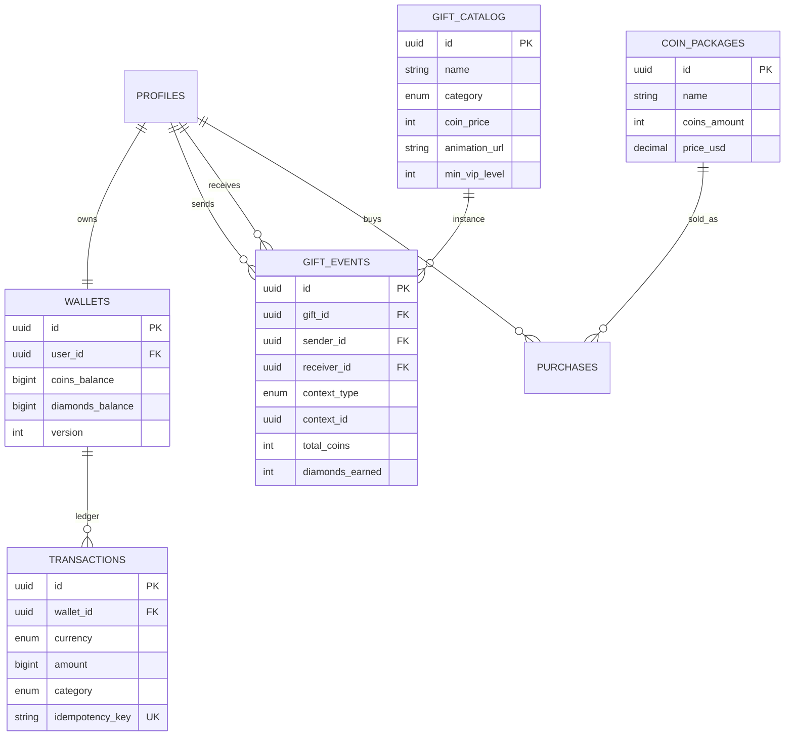
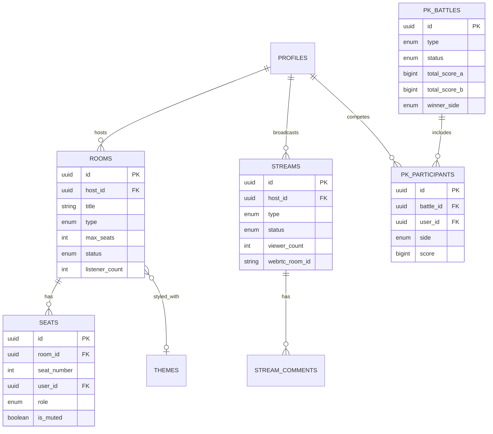
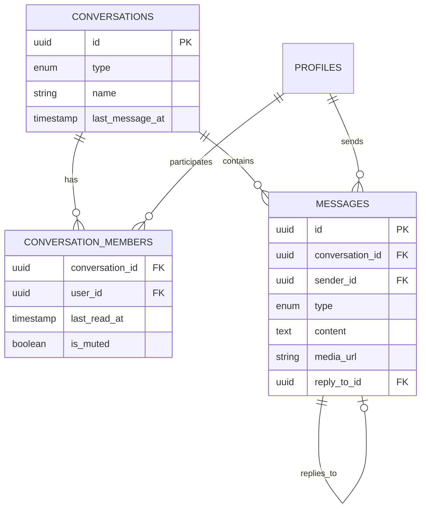
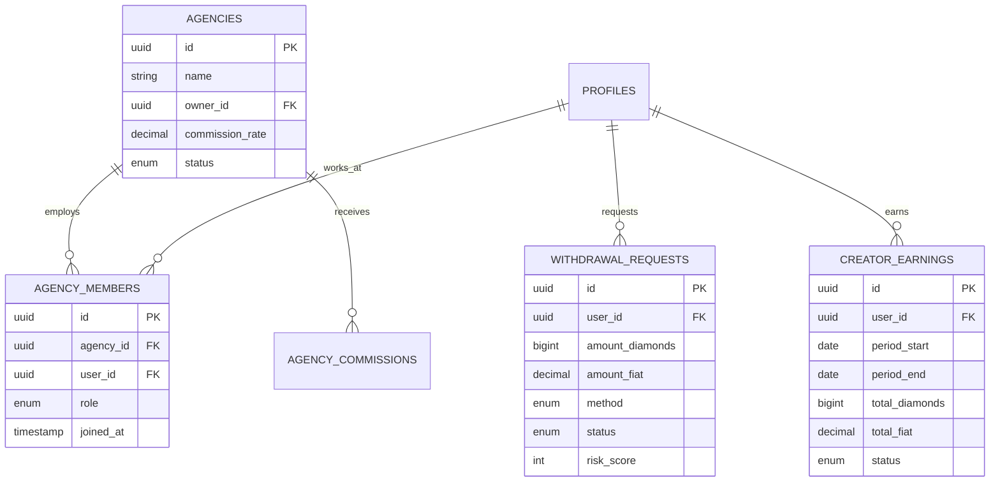
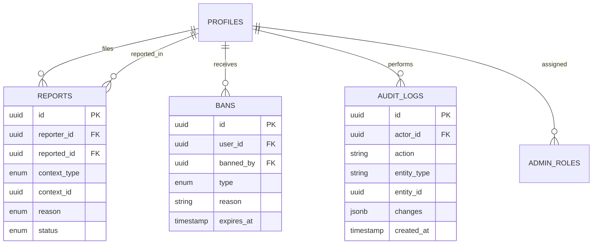

# Earn4U — Entity Relationship Diagrams

**Version:** 1.0.0  
**Last Updated:** June 2026

---

## 1. Core Domain ER Diagram

---

## 2. Authentication Domain

---

## 3. Economy & Gifting Domain

---

## 4. Real-Time Entertainment Domain

---

## 5. Messaging Domain

---

## 6. Creator Economy Domain

---

## 7. Admin & Moderation Domain

---

## 8. Key Relationships Summary

| Relationship | Cardinality | Description |
|-------------|-------------|-------------|
| Profile → Wallet | 1:1 | Every user has exactly one wallet |
| Profile → Credentials | 1:0..1 | OAuth-only users may lack credentials |
| Wallet → Transactions | 1:N | Immutable ledger entries |
| Profile → Follows | M:N | Self-referential through follows table |
| Room → Seats | 1:N | Fixed seat count per room |
| Battle → Participants | 1:N | 2–6 participants per battle |
| Conversation → Members | 1:N | 2–500 members per conversation |
| Agency → Members | 1:N | Hosts managed by agency |

---

## 9. Related Documents

- [Database Architecture](database-architecture.md)
- [API Specification](api-specification.md)
- [Technical Architecture](technical-architecture.md)
